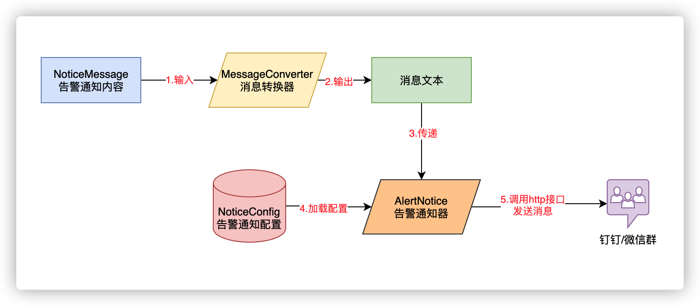

# jclipper-alert-notice

## 项目描述
支持钉钉机器人告警与企业微信告警，以`固定内容格式`将消息发送到企业微信群或钉钉群，并指出使用`手机号码`艾特特定人或艾特`所有人`

## Maven坐标
```xml
<dependency>
    <groupId>com.wf2311.jclipper</groupId>
    <artifactId>jclipper-alert-notice</artifactId>
    <version>2022.1-SNAPSHOT</version>
</dependency>
```

## 项目结构
```text
.
└── jclipper
        └── springboot
            └── alert
                ├── base
                │   ├── AlertNotice.java    #告警通知器
                │   ├── MessageConverter.java   #消息转换器
                │   ├── NoticeConfig.java   #告警通知配置类
                │   └── NoticeMessage.java  #告警通知内容，可以扩展
                └── core
                    ├── AbstractAlertNotice.java    #抽象类提醒通知
                    ├── convert
                    │   ├── AbstractFormatMessageConverter.java  #格式化的抽象消息转换器
                    │   ├── DingTalkMarkdownErrorMessageConverter.java  #钉钉markdown 错误消息转换器
                    │   ├── WorkWechatMarkdownErrorMessageConverter.java    #企业微信markdown 错误消息转换器
                    │   └── WorkWechatTextErrorMessageConverter.java    #企业微信文本 错误消息转换器
                    └── impl
                        ├── ComposeNoticeAlert.java #组合通知警告
                        ├── DingTalkMarkdownAlertNotice.java    #钉钉markdown 提醒通知
                        ├── WorkWechatMarkdownAlertNotice.java  #企业微信markdown 提醒通知
                        ├── WorkWechatTextAlertNotice.java  #企业微信文本 提醒通知
                        └── error
                            ├── DingTalkMarkdownErrorAlertNotice.java   #钉钉markdown 错误通知告警
                            ├── WorkWechatMarkdownErrorAlertNotice.java #企业微信markdown 错误消息告警
                            └── WorkWechatTextErrorAlertNotice.java #企业微信文本 错误消息告警
```

## 通知流程


## 使用示例

- 引用项目依赖
```xml
<dependency>
    <groupId>com.wf2311.jclipper</groupId>
    <artifactId>jclipper-alert-notice</artifactId>
    <version>2022.1-SNAPSHOT</version>
</dependency>
```

- 新建配置类AlertConfiguration
```java
@Configuration
public class AlertConfiguration {

    @Component("workWechatErrorAlertConfig")
    @ConditionalOnProperty(prefix = WorkWechatErrorAlertConfig.PREFIX, name = "enable", havingValue = "true")
    @ConfigurationProperties(prefix = WorkWechatErrorAlertConfig.PREFIX)
    @Data
    public static class WorkWechatErrorAlertConfig extends NoticeConfig {
        public static final String PREFIX = "jclipper.alert.work-wechat";
        private String url = WorkWechatMarkdownAlertNotice.URL;

        @PostConstruct
        public void init() {
            System.out.println("init");
        }

    }

    @Component("dingTalkErrorAlertConfig")
    @ConditionalOnProperty(prefix = DingTalkErrorAlertConfig.PREFIX, name = "enable", havingValue = "true")
    @ConfigurationProperties(prefix = DingTalkErrorAlertConfig.PREFIX)
    @Data
    public static class DingTalkErrorAlertConfig extends NoticeConfig {
        public static final String PREFIX = "jclipper.alert.dingtalk";

        private String url = DingTalkMarkdownAlertNotice.URL;

    }

    @ConditionalOnBean(name = "dingTalkErrorAlertConfig")
    @Bean("dingTalkMarkdownErrorAlert")
    @ConditionalOnMissingBean(name = "dingTalkMarkdownErrorAlert")
    public AlertNotice dingTalkMarkdownErrorAlert(DingTalkErrorAlertConfig config) {
        return new DingTalkMarkdownErrorAlertNotice(config);
    }

    @ConditionalOnBean(name = "workWechatErrorAlertConfig")
    @Bean("workWechatMarkdownErrorAlert")
    @ConditionalOnMissingBean(name = "workWechatMarkdownErrorAlert")
    public AlertNotice workWechatMarkdownErrorAlert(WorkWechatErrorAlertConfig config) {
        return new WorkWechatMarkdownErrorAlertNotice(config);
    }

    @ConditionalOnBean(name = "workWechatErrorAlertConfig")
    @Bean("workWechatTextErrorAlert")
    @ConditionalOnMissingBean(name = "workWechatTextErrorAlert")
    public AlertNotice workWechatTextErrorAlert(WorkWechatErrorAlertConfig config) {
        return new WorkWechatTextErrorAlertNotice(config);
    }


    @Bean
    @Primary
    public AlertNotice composeErrorAlert(List<AlertNotice> alerts) {
        return new ComposeNoticeAlert(alerts);
    }

}
```
- 声明配置
```yaml
jclipper:
  alert:
    dingtalk: #钉钉告警配置
     enable: true #是否启用钉钉告警，默认为false
     token: xxx #钉钉告警的webhook token
     at-mobiles: # 需要艾特的用户，使用数组形式进行指定（非必须）
       - xxxx
       - xyyy
     at-all: false  #是否进行艾特全员，默认为false
    work-wechat: #企业微信告警配置
      enable: true  #是否启用企业微信告警，默认为false
      token: xxxx  #企业微信告警的webhook token
      at-mobiles: # 需要艾特的用户，使用数组形式进行指定（非必须）
        - xxxx
        - xyyy
      at-all: true  #是否进行艾特全员，默认为false
```
- 测试方法
```java
public class TestAlerts extends TestApplication {

    @Resource(name = "dingTalkMarkdownErrorAlert")
    private AlertNotice dingTalkMarkdownErrorAlert;

    @Resource(name = "workWechatMarkdownErrorAlert")
    private AlertNotice workWechatMarkdownErrorAlert;

    @Resource(name = "workWechatTextErrorAlert")
    private AlertNotice workWechatTextErrorAlert;


    @Resource
    private AlertNotice alertNotice;


    @Test
    public void testSendWorkWechatMarkdownError() {
        workWechatMarkdownErrorAlert.send(build("这是一条发送到微信的markdown消息"));
    }

    @Test
    public void testSendWorkWechatTextError() {
        workWechatTextErrorAlert.send(build("这是一条发送到微信的文本消息"));
    }

    @Test
    public void testSendDingTalkMarkdownError() {
        dingTalkMarkdownErrorAlert.send(build("这是一条发送到钉钉的markdown消息"));
    }


    @Test
    public void testSendAll() {
        alertNotice.send(build("这是一条组合消息"));
    }

    private NoticeMessage build(String msg) {
        NoticeMessage m = new NoticeMessage();
        m.setAppName("jclipper-alert-notice");
        m.setTime(LocalDateTime.now());
        m.setCode(400);
        m.setError("这是测试消息，请忽略🏷😁");
        m.setMessage(msg);
        m.setTraceId(UUID.randomUUID().toString());
        m.setUrl("/test/alerts");
        m.setHost("192.168.150.78");
        m.setClient("127.0.0.1");
        m.setMessage(msg);
        return m;

    }
}
```
> 说明：如果想要自定义消息模板，需要自己实现`MessageConverter`，使用`WorkWechatMarkdownAlertNotice`或`DingTalkMarkdownAlertNotice`等类进行发送；


以上功能已集成到[exception-handler-spring-boot-starter](../jclipper-spring-boot-starters/exception-handler-spring-boot-starter/README.md)中：

详见以下几个类：
```text
jclipper.springboot.exception.configuration.GlobalExceptionHandlerAutoConfiguration
jclipper.springboot.exception.DubboExceptionFilter
jclipper.springboot.exception.DubboExceptionAlert
jclipper.springboot.exception.GlobalExceptionHandler#printWarnMessage
```

## Token获取
### 钉钉
[自定义机器人接入](https://developers.dingtalk.com/document/robots/custom-robot-access)

### 企业微信
`选中需要添加机器人的群` -> `右键选择"管理聊天信息"` -> `添加机器人`